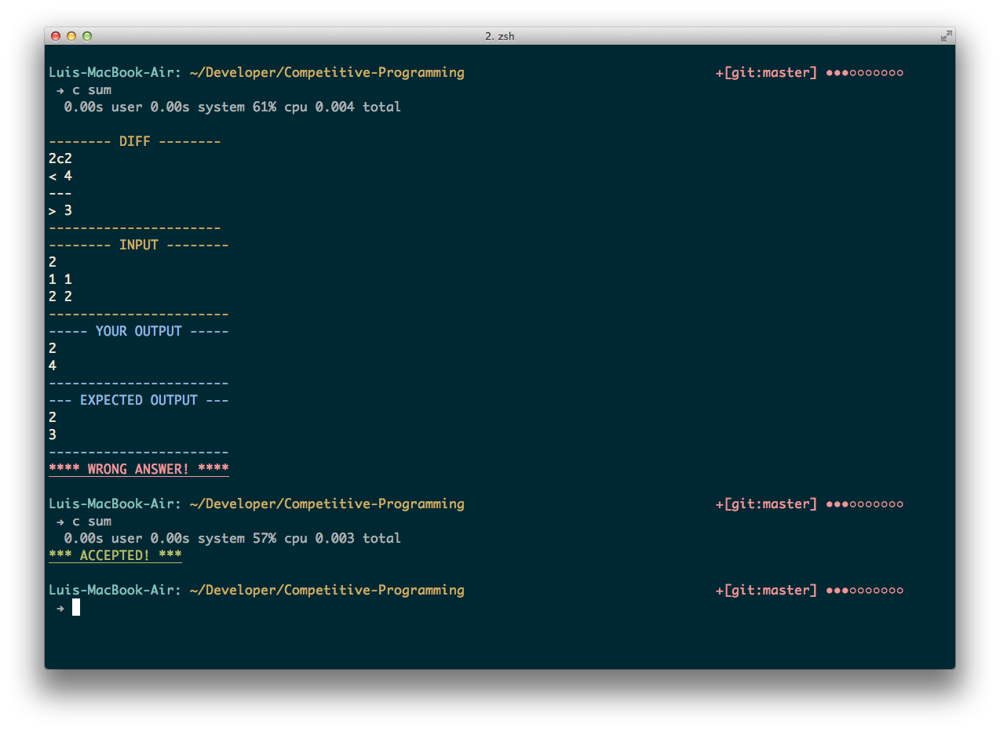

# Luis' dotfiles

This is my personal dotfiles, I'm basically using [oh-my-zsh](https://github.com/robbyrussell/oh-my-zsh) with a single zsh theme modified by me and the git plugin, removing all unnecesary plugins, themes, etc. 
It's all I need for now.

I also created my own plugin for testing C++ code for programming contests, it has been saving me a lot of time.

## Installation
